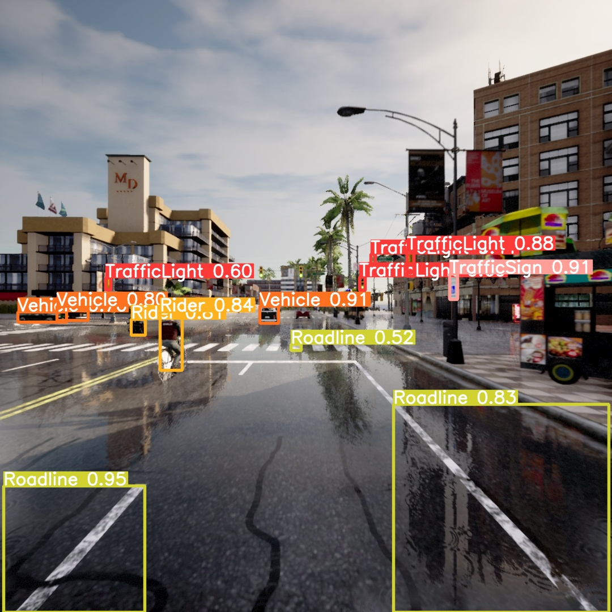

# 本科毕业设计

## 代码介绍：

- DataGenerate文件：用来连接Carla生成交通场景和进行数据采集
  1. main.py:主文件
  2. generate_traffic.py:生成交通流
  3. We.py:同步模式周期变化天气
  4. Sensor.py:设置生成特定属性的传感器，包含自定义类
- autolabel.py:进行数据的自动标注，数据标签的保存，yolo和voc格式的转换，以及查看标注效果
- config.py:设置自动标注的类别以及限制
- yolov5master文件：进行对于仿真数据集的网络训练和检测
  1. train.py:进行训练
  2. detect.py:进行预测
- split文件：存放测试集和训练集的数据路径，两个txt
- label：存放voc格式的label，存放目录与data的目录结构一致
- yololabel：存放yolo格式的label

## 几个结果：

- ./yolov5master/runs/train/exp68:为本模型的最终训练结果
- ./yolov5master/runs/detect/exp20：为20张图片和一个视频的预测结果

## 数据集的下载：

	链接：https://pan.baidu.com/s/1CEdL9EJ8DNgED48EVWB5yQ   提取码：ww6j
​	将data文件放在主目录下，直接全部覆盖。包含6张carla地图的拍摄数据，包括Town01——Town05和Town10，每个地图文件下包含了rgb0,seg0和visseg0三个文件夹,rgb0存储rgb图片，seg0存储Carla原语义分割图,visseg0存储Carla可视化语义分割图。关于语义分割图中的信息可参考网页:[Sensors reference - CARLA Simulator](https://carla.readthedocs.io/en/latest/ref_sensors/#semantic-segmentation-camera)。0代表相机组的组号，本系统支持多组相机共同拍摄，并且会为各自创建单独的文件夹，如rgb1，rgb2等，取决于传感器组的数量。

​	当主目录中的data每个地图只存放了一张rgb图片和与之对应的seg和visseg图片，label以及yololabel都是对这几张图片使用autolabel脚本得到的标签。

​	在DataGenerate文件夹中，可以使用main脚本进行仿真数据的采集从而可以训练自己设定的仿真数据集。

## 运行流程：

- 下载数据集或者是自己生成仿真数据集并将data文件放至主目录。
- 运行autolabel.py对每一张图片进行自动标注，并将有目标的图片路径划分为训练集和测试集，两个txt文件保存至split文件中，并将标注的标签分别保存为voc格式（label文件夹下），和yolo格式（yololabel文件夹下），其中voc标签的目录形式与data一致，而yolo格式的标签顺序与split中txt中的图片路径顺序一致。
- 使用yolov5进行训练和检测，该系统使用的是yolo格式标签，如果使用voc格式标签，可以自行修改代码。
- 在yolov5master文件夹下，best.pt为本系统最终的训练参数，yolov5s.pt为本系统的预训练权重。

